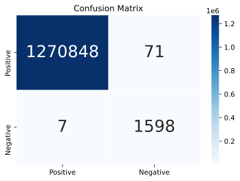

- [Intro](#intro)
  - [The Blocker Fraud Company](#the-blocker-fraud-company)
  - [Expansion Strategy in Brazil](#expansion-strategy-in-brazil)
  - [Context](#context)
  - [Content](#content)
  - [Goal](#goal)
  - [Data](#data)
  - [Analysis](#analysis)
  - [Evaluation](#evaluation)
- [1.0. About the Data](#10-about-the-data)
  - [1.1. Columns Description](#11-columns-description)
  - [1.2. Numerical Attributes](#12-numerical-attributes)
  - [1.3. Categorical Attributes](#13-categorical-attributes)
- [2.0. Hypotheses Creation](#20-hypotheses-creation)
  - [2.1. Hypotheses List](#21-hypotheses-list)
- [3.0. Exploratory Data Analysis (E.D.A)](#30-exploratory-data-analysis-eda)
  - [3.1. Univariate Analysis](#31-univariate-analysis)
    - [3.1.1. Target variable](#311-target-variable)
    - [3.1.2. Numerical variables distribution](#312-numerical-variables-distribution)
    - [3.1.3. Categorical variable](#313-categorical-variable)
  - [3.2. Bivariate Analysis](#32-bivariate-analysis)
    - [H1. Frauds occur with 3 types of transfers.](#h1-frauds-occur-with-3-types-of-transfers)
    - [H2. Fraud occur with low values amounts.](#h2-fraud-occur-with-low-values-amounts)
    - [H3. Fraud occur with high values of old balance origin.](#h3-fraud-occur-with-high-values-of-old-balance-origin)
    - [H4. Fraud occur with new balance origin is equal zero.¶](#h4-fraud-occur-with-new-balance-origin-is-equal-zero)
    - [H5. Fraud occur with low values old balance destination.](#h5-fraud-occur-with-low-values-old-balance-destination)
    - [H6. All fraudulent transaction occur with new receiver balance equal zero.](#h6-all-fraudulent-transaction-occur-with-new-receiver-balance-equal-zero)
    - [H7. Customer to customer transactions represent 50% of the total fraudulent transactions.](#h7-customer-to-customer-transactions-represent-50-of-the-total-fraudulent-transactions)
    - [H8. Merchant receiver represents 40% of the total fraudulent transactions.](#h8-merchant-receiver-represents-40-of-the-total-fraudulent-transactions)
    - [H9. Most Fraud occurs between days 10 and 20.](#h9-most-fraud-occurs-between-days-10-and-20)
    - [H10. All flagged frauds represent 90% of frauds transactions.¶](#h10-all-flagged-frauds-represent-90-of-frauds-transactions)
- [4.0. Machine Learning Modeling](#40-machine-learning-modeling)
  - [4.1. Cross Validation](#41-cross-validation)
- [5.0. Final Model: Random Forest Classifier](#50-final-model-random-forest-classifier)
- [6.0. Business Performance](#60-business-performance)
  - [11.1. What is the model's *precision* and *accuracy*?](#111-what-is-the-models-precision-and-accuracy)
    - [11.1.1. Performance](#1111-performance)
  - [11.2. How reliable is the model in classifying transactions as *legitimate* or *fraudulent*?](#112-how-reliable-is-the-model-in-classifying-transactions-as-legitimate-or-fraudulent)
    - [11.2.1. Real Performance](#1121-real-performance)
  - [11.3.  What is the expected billing by the company if we classify 100% of data transactions with the model?](#113--what-is-the-expected-billing-by-the-company-if-we-classify-100-of-data-transactions-with-the-model)
  - [11.4. What is the loss expected by company in case of model failure?](#114-what-is-the-loss-expected-by-company-in-case-of-model-failure)
  - [11.5. What is the profit expected by the Blocker Fraud Company when using model?](#115-what-is-the-profit-expected-by-the-blocker-fraud-company-when-using-model)

# Intro 

## The Blocker Fraud Company 

**Blocker Fraud Company** is a specialized company in fraud detection on financial transactions through mobile devices. It has the "Blocker Fraud" service, which guarantee the block of fraudulent transactions.

The company business model is service type, with monetization made by performance of the provided service. The user pay a fixed fee on the fraud detection success.

## Expansion Strategy in Brazil 

Aiming to expand business in Brazil it has adopted the following strategy:

- The company will receive 25% of the value of each transaction detected as *fraud*.  
- The company will receive 5% of the value of each transaction detected as *fraud*, but the transaction is *legitimate*.  
- The company will return 100% of the value to the customer, for each transaction detected as legitimate, however a transaction is a fraud.  

## Context 

There is a lack of public available data sets on financial services and specially in the emerging mobile money transactions domain. Financial data sets are important to many researchers and in particular to us performing research in the domain of fraud detection. Part of the problem is the intrinsically private nature of financial transactions, that leads to no publicly available datasets.

We present a synthetic data set generated using the simulator called PaySim as an approach to such a problem. PaySim uses aggregated data from the private data set to generate a synthetic data set that resembles the normal operation of transactions and injects malicious behavior to later evaluate the performance of fraud detection methods.

## Content 

PaySim simulates mobile money transactions based on a sample of real transactions extracted from one month of financial logs from a mobile money service implemented in an African country. The original logs were provided by a multinational company, who is the provider of the mobile financial service which is currently running in more than 14 countries all around the world.

This synthetic data set is scaled down 1/4 of the original data set and it is created just for Kaggle.

## Goal 

1. What is the model's *precision* and *accuracy*?  

2. How reliable is the model in classifying transactions as *legitimate* or *fraudulent*?  

3. What is the expected billing by the company if we classify 100% of data transactions with the model?  

4. What is the loss expected by company in case of model failure ?  

5. What is the profit expected by the **Blocker Fraud Company** when using model?

   > Disclaimer: The following context is completely fictional, the company, the context, the CEO and the business questions.

## Data 

Data provided by Kaggle: [Synthetic Financial Datasets for Fraud Detection](https://www.kaggle.com/ntnu-testimon/paysim1)

## Analysis 

This solution will use descriptive statistics and data visualization to find key figures in understanding the distribution, count, and relationship between variables. Since the goal of the project to make predictions on the fraud's detection, classification algorithms from the supervised learning family of machine learning models will be implemented.

## Evaluation 

The project will conclude with the evaluation of the machine learning model selected with a validation data set. The output of the predictions can be checked through a confusion matrix, and metrics such as accuracy, precision, recall, F1 and Kappa scores.


# 1.0. About the Data

 To understand the business problem, we are inspecting to get familiar with data set to understand how complex is the problem.

```
<class 'pandas.core.frame.DataFrame'>
RangeIndex: 6362620 entries, 0 to 6362619
Data columns (total 11 columns):
 #   Column          Non-Null Count    Dtype  
---  ------          --------------    -----  
 0   step            6362620 non-null  int64  
 1   type            6362620 non-null  object 
 2   amount          6362620 non-null  float64
 3   nameOrig        6362620 non-null  object 
 4   oldbalanceOrg   6362620 non-null  float64
 5   newbalanceOrig  6362620 non-null  float64
 6   nameDest        6362620 non-null  object 
 7   oldbalanceDest  6362620 non-null  float64
 8   newbalanceDest  6362620 non-null  float64
 9   isFraud         6362620 non-null  int64  
 10  isFlaggedFraud  6362620 non-null  int64  
dtypes: float64(5), int64(3), object(3)
memory usage: 534.0+ MB
```

- Data set size is 6,362,620 rows and 11 columns.
- Type and Structure: The data set is huge, with memory usage more than 534.0 MB and no missing values.


## 1.1. Columns Description

| Feature        | Description                                                  |
| -------------- | ------------------------------------------------------------ |
| step           | maps a unit of time in the real world. In this case 1 step is 1 hour of time. Total steps 744 (30 days simulation). |
| type           | Transaction type (CASH-IN, CASH-OUT, DEBIT, PAYMENT and TRANSFER) |
| amount         | amount of the transaction in local currency                  |
| nameOrig       | customer who started the transaction                         |
| oldbalanceOrg  | initial balance before the transaction                       |
| newbalanceOrig | new balance after the transaction                            |
| nameDest       | customer who is the recipient of the transaction             |
| oldbalanceDest | initial balance recipient before the transaction. Note that there is not information for customers that start with M (Merchants) |
| newbalanceDest | new balance recipient after the transaction. Note that there is not information for customers that start with M (Merchants) |
| isFraud        | This is the transactions made by the fraudulent agents inside the  simulation. In this specific dataset the fraudulent behavior of the  agents aims to profit by taking control or customers accounts and try to empty the funds by transferring to another account and then cashing out of the system |
| isFlaggedFraud | The business model aims to control massive transfers from one  account to another and flags illegal attempts. An illegal attempt in  this dataset is an attempt to transfer more than 200K in a single  transaction |


## 1.2. Numerical Attributes

|                  | count     | mean         | std          | min  | 25%          | 50%           | 75%          | max         | range       | unique val. | variation coefficient | skew     | kurtosis    |
| ---------------- | --------- | ------------ | ------------ | ---- | ------------ | ------------- | ------------ | ----------- | ----------- | ----------- | --------------------- | -------- | ----------- |
| step             | 6362620.0 | 2.433972e+02 | 1.423320e+02 | 1.0  | 156.000000   | 239.000000    | 3.350000e+02 | 743.0       | 742.0       | 743         | 0.5848                | 0.3752   | 0.3291      |
| amount           | 6362620.0 | 1.779883e+05 | 5.991358e+05 | 0.0  | 13389.570312 | 74871.937500  | 2.087215e+05 | 92445520.0  | 92445520.0  | 5236933     | 3.3662                | 30.9939  | 1797.9567   |
| oldbalance_orig  | 6362620.0 | 8.246191e+05 | 2.831753e+06 | 0.0  | 0.000000     | 14208.000000  | 1.073152e+05 | 59585040.0  | 59585040.0  | 1834373     | 3.4340                | 5.2491   | 32.9649     |
| newbalance_orig  | 6362620.0 | 8.503204e+05 | 2.862818e+06 | 0.0  | 0.000000     | 0.000000      | 1.442584e+05 | 49585040.0  | 49585040.0  | 2663280     | 3.3668                | 5.1769   | 32.0670     |
| oldbalance_dest  | 6362620.0 | 1.097866e+06 | 3.369338e+06 | 0.0  | 0.000000     | 132705.664062 | 9.430367e+05 | 356015904.0 | 356015904.0 | 3532215     | 3.0690                | 19.9218  | 948.6741    |
| newbalance_dest  | 6362620.0 | 1.221764e+06 | 3.629806e+06 | 0.0  | 0.000000     | 214661.445312 | 1.111909e+06 | 356179264.0 | 356179264.0 | 3474507     | 2.9710                | 19.3523  | 862.1565    |
| is_fraud         | 6362620.0 | 1.290820e-03 | 3.590480e-02 | 0.0  | 0.000000     | 0.000000      | 0.000000e+00 | 1.0         | 1.0         | 2           | 27.8155               | 27.7795  | 769.7030    |
| is_flagged_fraud | 6362620.0 | 2.514687e-06 | 1.585775e-03 | 0.0  | 0.000000     | 0.000000      | 0.000000e+00 | 1.0         | 1.0         | 2           | 630.6051              | 630.6036 | 397659.0625 |

* Features with high skew: `amount`, `oldbalance_orig`, `newbalance_orig`, `oldbalance_dest`, `newbalance_dest`, `is_fraud`, `is_flagged_fraud`.
* Features with high kurtosis: `amount`, `oldbalance_orig`, `newbalance_orig`, `oldbalance_dest`, `newbalance_dest`, `is_fraud`, `is_flagged_fraud`.


## 1.3. Categorical Attributes

|           | count   | unique  |
| --------- | ------- | ------- |
| type      | 6362620 | 5       |
| name_orig | 6362620 | 6353307 |
| name_dest | 6362620 | 2722362 |


# 2.0. Hypotheses Creation


## 2.1. Hypotheses List

| #    | HYPOTHESES                                                   |
| ---- | ------------------------------------------------------------ |
| h1   | Frauds occur with 3 types of transfers.                      |
| h2   | Fraud occur with low values amounts.                         |
| h3   | Fraud occur with high values of old origin balance.          |
| h4   | Fraud occur with new balance origin is equal zero.           |
| h5   | Fraud occur with low values old balance destination.         |
| h6   | All fraudulent transaction occur with new receiver balance equal zero. |
| h7   | Customer to customer transactions represent 50% of the total fraudulent transactions. |
| h8   | Merchant receiver represents 40% of the total fraudulent transactions. |
| h9   | Most Fraud occurs between days 10 and 20.                    |
| h10  | All flagged frauds represent 90% of frauds transactions.     |


# 3.0. Exploratory Data Analysis (E.D.A)


## 3.1. Univariate Analysis

### 3.1.1. Target variable


* 99.9% of the transactions are no fraudulent;
* 0.1% of the transactions are fraudulent;
* The dataset is imbalanced;

### 3.1.2. Numerical variables distribution


* In general, the major concentration is around zero.

### 3.1.3. Categorical variable


As observed, the cash out transfer represents 35.2% follow by payment with 33.8%


Regular customer represents 66.2% of transactions destination.


## 3.2. Bivariate Analysis

### H1. Frauds occur with 3 types of transfers.

**FALSE**: There's only two types of fraudulent transactions: `CASH_OUT` and `TRANSFER`.


### H2. Fraud occur with low values amounts.

**TRUE**: Fraudulent transactions occur more frequently at lower amounts


### H3. Fraud occur with high values of old balance origin.

**TRUE**: Fraud occur with high values, but on a smaller scale.


### H4. Fraud occur with new balance origin is equal zero.[¶](https://render.githubusercontent.com/view/ipynb?color_mode=light&commit=537a50b24d891af236ae6c03592feb57987561ab&enc_url=68747470733a2f2f7261772e67697468756275736572636f6e74656e742e636f6d2f7666616d696d2f446174612d536369656e63652f353337613530623234643839316166323336616536633033353932666562353739383735363161622f426c6f636b657225323046726175642f7665723030315f626c6f636b65725f66726175642e6970796e62&nwo=vfamim%2FData-Science&path=Blocker+Fraud%2Fver001_blocker_fraud.ipynb&repository_id=312286607&repository_type=Repository#H4.-Fraud-occur-with-new-balance-origin-is-equal-zero.)

**TRUE**: Fraud generally occur when the New Balance Origin is equal zero.


### H5. Fraud occur with low values old balance destination.

**TRUE**


### H6. All fraudulent transaction occur with new receiver balance equal zero.

**FALSE**: Some balance destination are greater than zero.


### H7. Customer to customer transactions represent 50% of the total fraudulent transactions.

**FALSE**: 100% of fraudulent transactions are customer-to-customer.


### H8. Merchant receiver represents 40% of the total fraudulent transactions.

**FALSE**: None of fraudulent transactions are for merchants.


### H9. Most Fraud occurs between days 10 and 20.

**FALSE**: Fraud occur between days 20 and 31.


### H10. All flagged frauds represent 90% of frauds transactions.[¶](https://render.githubusercontent.com/view/ipynb?color_mode=light&commit=537a50b24d891af236ae6c03592feb57987561ab&enc_url=68747470733a2f2f7261772e67697468756275736572636f6e74656e742e636f6d2f7666616d696d2f446174612d536369656e63652f353337613530623234643839316166323336616536633033353932666562353739383735363161622f426c6f636b657225323046726175642f7665723030315f626c6f636b65725f66726175642e6970796e62&nwo=vfamim%2FData-Science&path=Blocker+Fraud%2Fver001_blocker_fraud.ipynb&repository_id=312286607&repository_type=Repository#H10.-All-flagged-frauds-represent-90%-of-frauds-transactions.)

**FALSE**: 0.2% of the total fraudulent transactions are flagged as fraud.


# 4.0. Machine Learning Modeling

|                     | Accuracy | Precision | Recall   | F1       | ROC      |
| ------------------- | -------- | --------- | -------- | -------- | -------- |
| Baseline            | 0.499483 | 0.001250  | 0.495950 | 0.002493 | 0.497719 |
| Logistic Regression | 0.960864 | 0.027490  | 0.873520 | 0.053303 | 0.917247 |
| Random Forest       | 0.999994 | 0.998751  | 0.996262 | 0.997505 | 0.998130 |
| XGBoost Classifier  | 0.999939 | 0.957460  | 0.995639 | 0.976176 | 0.997791 |

| BASELINE: DUMMY CLASSIFIER           | LOGISTIC REGRESSION                  |
| ------------------------------------ | ------------------------------------ |
|  |  |

|  RANDOM FOREST CLASSIFIER                                      | XGBOOST CLASSIFIER|
| ------------------------------------------------------------ | ------------------------------------------------------------ |
|  |  |

## 4.1. Cross Validation

|                          | test_Accuracy     | test_Precision    | test_Recall       | test_F1           | test_ROC          |
| ------------------------ | ----------------- | ----------------- | ----------------- | ----------------- | ----------------- |
| Logistic Regression      | 0.9164 +/- 0.0045 | 0.9447 +/- 0.0277 | 0.8851 +/- 0.038  | 0.9136 +/- 0.0076 | 0.9164 +/- 0.0045 |
| Random Forest Classifier | 1.0 +/- 0.0       | 1.0 +/- 0.0       | 1.0 +/- 0.0       | 1.0 +/- 0.0       | 1.0 +/- 0.0       |
| XGBoost Classifier       | 0.9985 +/- 0.0002 | 0.9999 +/- 0.0    | 0.9971 +/- 0.0003 | 0.9985 +/- 0.0002 | 0.9985 +/- 0.0002 |

As observed, Random Forest Classifier appears with a perfect score for presenting rounded values, even so, the result was excellent.


# 5.0. Final Model: Random Forest Classifier

It's time to improve our model using GridsearchCV to find the best parameters. In grid search the process of performing hyper parameter tuning in order to  determine the optimal values for a given model. Note that there is no way to know in advance the best  values for hyper parameters so ideally, we need to try all possible  values to know the optimal values. Doing this manually could take a  considerable amount of time and resources and thus we use GridSearchCV  to automate the tuning of hyper parameters. GridSearchCV tries all the combinations of the values passed in the  dictionary and evaluates the model for each combination using the Cross-Validation method.

Here our results:

|               | Accuracy | Precision | Recall   | F1       | ROC      |
| ------------- | -------- | --------- | -------- | -------- | -------- |
| Random Forest | 0.999991 | 0.996883  | 0.996262 | 0.996572 | 0.998129 |


# 6.0. Business Performance

## 11.1. What is the model's *precision* and *accuracy*?


### 11.1.1. Performance

|      | NAME                | ACCURACY | PRECISION | RECALL   | F1       | ROC      |
| ---- | ------------------- | -------- | --------- | -------- | -------- | -------- |
| 0    | Baseline            | 0.499483 | 0.001250  | 0.495950 | 0.002493 | 0.497719 |
| 1    | Logistic Regression | 0.960864 | 0.027490  | 0.873520 | 0.053303 | 0.917247 |
| 2    | Random Forest       | 0.999994 | 0.998751  | 0.996262 | 0.997505 | 0.998130 |
| 3    | XGBoost Classifier  | 0.999939 | 0.957460  | 0.995639 | 0.976176 | 0.997790 |
| 4    | Random Forest+      | 0.999991 | 0.996883  | 0.996262 | 0.996572 | 0.998129 |

## 11.2. How reliable is the model in classifying transactions as *legitimate* or *fraudulent*?


### 11.2.1. Real Performance

|                           | real_accuracy | std_accuracy | real_precision | std_precision | real_recall | std_recall | real_f1 | std_f1 | real_roc | std_roc |
| ------------------------- | ------------- | ------------ | -------------- | ------------- | ----------- | ---------- | ------- | ------ | -------- | ------- |
| Logistic Regression       | 0.9164        | 0.0045       | 0.9447         | 0.0277        | 0.8851      | 0.0380     | 0.9136  | 0.0076 | 0.9164   | 0.0045  |
| Random Forest Classifier  | 1.0000        | 0.0000       | 1.0000         | 0.0000        | 1.0000      | 0.0000     | 1.0000  | 0.0000 | 1.0000   | 0.0000  |
| XGBoost Classifier        | 0.9985        | 0.0002       | 0.9999         | 0.0000        | 0.9971      | 0.0003     | 0.9985  | 0.0002 | 0.9985   | 0.0002  |
| Random Forest Classifier+ | 0.9987        | 0.0003       | 1.0000         | 0.0000        | 0.9974      | 0.0007     | 0.9987  | 0.0004 | 0.9987   | 0.0003  |

## 11.3.  What is the expected billing by the company if we classify 100% of data transactions with the model?

```
The company will receive $3,011,586,048.00 dua to transaction truly detected as fraud.
--------------------------------------------------------------------------------------------------
The company will receive $421,231.81 due to transaction detected as fraud, but actually legitimate.
--------------------------------------------------------------------------------------------------
The company will give back $10,071,736.00 due to transactions detected as legitimate, but actually fraud.
```

## 11.4. What is the loss expected by company in case of model failure?

```
The company will give back $10,071,736.00 due to transactions detected as legitimate, but actually fraud.
```

## 11.5. What is the profit expected by the Blocker Fraud Company when using model?

```
The profit of Blocker Fraud Company is: $3,001,935,360.00.
```
